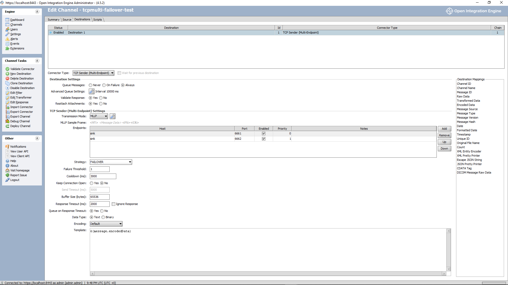
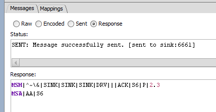

# Multi-Endpoint TCP Sender (OIE / Mirth connector)

A **destination connector** for [Open Integration Engine](https://openintegrationengine.org) (OIE, the
open-source Mirth Connect fork) that sends HL7-over-MLLP to a **list of `host:port` endpoints** with a
selectable strategy, instead of the stock TCP Sender's single Remote Address/Port. Server-side it subclasses
the stock TCP Sender — MLLP framing, keep-alive, ACK handling, and queueing are unchanged — and adds the
endpoint list, failover/failback, and a per-endpoint health circuit-breaker.

**Compatibility:** built and tested against **OIE 4.5.2**. Mirth/OIE gate extensions on an exact engine
version, so this build loads only on 4.5.2; rebuild against another engine's artifacts to target it (see
[`docs/BUILD.md`](docs/BUILD.md)).

## When to use it
- You have **2+ interchangeable endpoints for one logical destination** (e.g. an active/standby PACS/RIS
  pair) and want failover configured **in the connector**, not in a load balancer or a transformer.
- You want operators to change a target by **editing the channel**, not editing infrastructure.
- The receiver needs a **single, stable keep-alive connection** — see Sticky.

## Strategies
- **Failover** — endpoints ordered by `priority`; sends to the highest-priority reachable one and
  **auto-fails-back** when a higher-priority endpoint recovers. One active endpoint at a time.
- **Sticky** — pins to one endpoint until it fails, then pins to the next (no priority, no failback). For
  systems that need one stable keep-alive connection (see PowerScribe 360, below). Requires the destination
  queue at 1 thread.

## Why not an LB, or multiple destinations?
(The first question most people ask.)

- **vs. a TCP load balancer (nginx / HAProxy / VIP):** for plain failover an LB works — prefer it if you
  already run one or want load-spreading. This plugin's draw is no extra box to run and patch, the endpoint
  list living in the channel (change a target there, not via a config-file → git → CI → redeploy cycle), and
  handling per-session-ACK systems that break LB health checks (see PowerScribe 360).
- **vs. multiple channel destinations:** you *can* build failover with a response transformer + the queue —
  we ran that in production for years. It works, but the endpoint IPs live in transformer code and each
  channel needs its own bespoke wiring, versus selecting **"TCP Sender (Multi-Endpoint)"** and filling a table.
- **vs. round-robin:** intentionally omitted from v1 — it needs multiple concurrent connections (which fight
  keep-alive and are unsafe for per-session-ACK systems like PS360), and these HA deployments want failover,
  not load-spreading. Can be added later as an opt-in.

**PowerScribe 360 4.0** (and systems like it) returns the TCP response to the **last-connected session**, not
the sender — which breaks LB health checks (the probe connection steals the ACK) and misroutes responses
whenever more than one connection is open. It's also more reliable with keep-connection-open. **Sticky** is
built for exactly this: one endpoint, one persistent connection, no health-probing.

## Configuration
An endpoint table (**host, port, enabled, priority, notes**), a **strategy** (Failover / Sticky), a **failure
threshold** (consecutive connect failures before an endpoint is marked down), and a **cooldown** (how long it
stays down before one probe). All other TCP settings (transmission mode / MLLP, timeouts, queue) are the
stock TCP Sender's; every input has a hover tooltip.



> The panel covers the endpoint table plus the common TCP fields. A few stock advanced options (Test
> Connection, local-address binding, server mode) aren't surfaced yet, and **TLS** — while inherited by the
> transport — isn't exercised by the tests or exposed in this panel; verify it separately before relying on it.

## Behavior & operational requirements
Read before deploying — these follow from how MLLP/TCP actually behave:

- **When it fails over:** on a **connect-phase** failure only — connection refused, a **connect timeout
  (a dead / blackholed node)**, or a misconfigured address/port. Nothing was written, so moving to another
  endpoint is safe. On any **post-write** outcome (write error, or an **ACK-read timeout** = lost ACK) it does
  **not** move — it returns the message so the queue retries the **same** endpoint.
- **Duplicate semantics are the same as the stock TCP Sender.** MLLP delivery is at-least-once: a lost ACK
  makes the queue retry, so a receiver can see a message twice — equally true of the plain TCP Sender. Because
  failover is connect-phase-only, this plugin adds **no cross-endpoint duplication**.
- **All endpoints down →** the message queues (never dropped) and drains when one returns. Set the connector
  **`retryCount = 0`** and **enable the destination queue** — the queue owns retries.
- **Failover latency:** a refused endpoint fails over almost immediately; a dead (timing-out) node costs
  ~`responseTimeout` first. Keep `responseTimeout` modest — it also bounds the legitimate ACK wait.
- **Which endpoint received a message:** recorded on success in the response status
  (`SENT: … [sent to host:port]`) and on the connector-map key `tcpmultiEndpoint`.

  
- **Seeing failover in the log:** endpoint **DOWN / RECOVERED** transitions log at `WARN`, once per
  transition (not per message). OIE's default root log level suppresses these; to see them, add to
  `conf/log4j2.properties`:
  ```properties
  logger.tcpmulti.name = com.mirth.connect.connectors.tcpmulti
  logger.tcpmulti.level = INFO
  ```
- **Keep-Connection-Open:** set `sendTimeout > 0` so idle sockets are reaped.

## Limitations
- **Not cluster-safe** — health/selection state is in-memory per JVM, not shared across nodes; don't run it
  behind a clustered / shared-VIP OIE.
- **Sticky requires the destination queue at 1 thread** (the socket cache is keyed per queue thread); the
  connector enforces it. For a single physical connection under Failover, use 1 thread too.
- **No round-robin / load-spreading** in v1 (by design).
- **Partial GUI parity**, and **TLS is not surfaced or tested** in this connector (above).
- **Validation is manual, not CI-gated:** a scripted live-failover driver
  (`test-harness/run-failover-scenarios.sh`) exercises the failover scenarios against a local OIE container;
  CI runs the 36 unit tests plus a plugin-load smoke test (the JUnit integration tests are harness stubs).

## Install (prebuilt)
Download `tcpmulti-<version>.zip` from Releases → in the Administrator, **Settings → Extensions → Install
Extension** → select the zip → **restart the OIE server**. The connector then appears as **"TCP Sender
(Multi-Endpoint)"** in the destination dropdown; add it to a channel and **redeploy** the channel for changes
to take effect.

> The release is **self-signed**, so the Administrator Launcher won't load it unless you launch with **`-k`**
> (`--allow-self-signed`) — on Windows, append ` -k` to the Launcher shortcut's *Target*. (The server loads
> it fine either way; `-k` only affects the GUI.)

## Build from source
Maven multi-module (client / shared / server) producing the OIE extension zip; needs the OIE engine artifacts
on the classpath (extracted from the OIE Docker image). See [`docs/BUILD.md`](docs/BUILD.md).

## Design docs & credit
- [`DESIGN.md`](DESIGN.md) — decisions, strategies, failure semantics.
- [`SPEC.md`](SPEC.md) — build-facing spec (classes, algorithms, acceptance criteria).

MPL-2.0. Thanks to **[@pacmano1](https://github.com/pacmano1)**, whose OIE plugin-development guide informed
the build, and to the Open Integration Engine project.
